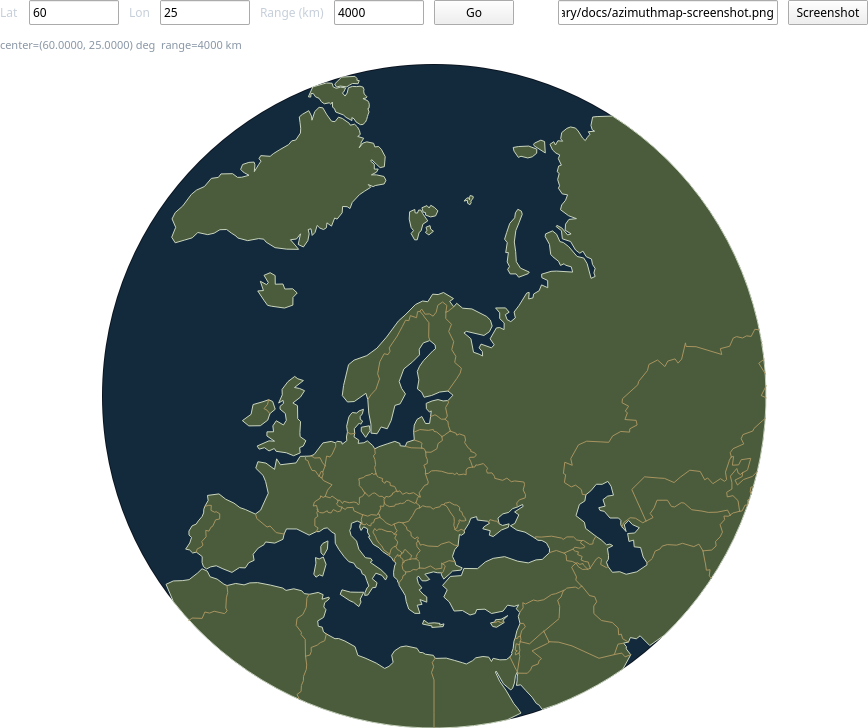
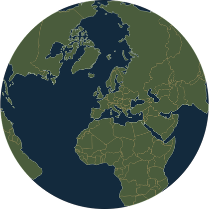
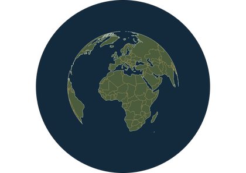
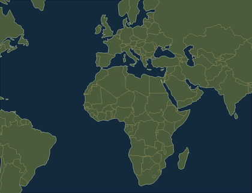

#wrenium - geo

[](https://github.com/wrenium/wrenium-geo/actions/workflows/ci.yml)
[](https://api.reuse.software/info/github.com/wrenium/wrenium-geo)

[API documentation](https://wrenium.github.io/wrenium-geo/)

A C++17 header-only geometry library that projects geographic coastline and
border data onto a 2D plane. Three projections are supported: azimuthal
equidistant, azimuthal orthographic, and whole-world Web Mercator. Output
is either an SVG path string or a compact binary path stream. Built for
constrained environments: zero heap allocation, and no exceptions or RTTI
anywhere in the library.



## Features

- **Azimuthal equidistant/orthographic**, centered on any point on Earth,
  via a rotate -> clip -> project pipeline
  (`wrenium::geo::azimuthal::projectRings`/`projectLines`/`projectPoint`,
  `azimuthal_pipeline.h`): rotates the sphere so that center point becomes
  the pole, clips coastline/border data down to a configurable radius
  around it, then projects what's left with a closed-form radial-distance
  formula. Selected via a `ProjectionType` argument (no default -- always passed
  explicitly): **equidistant** (true distance and bearing from the
  center point are preserved exactly) and **orthographic** (renders as if
  viewed from infinitely far away -- the disk edge is the horizon; only
  meaningful up to a 90 degree clip radius).
- **Whole-world Web Mercator** (`wrenium::geo::cylindrical::projectRings`/
  `projectLines`, `cylindrical_pipeline.h`): no exact per-point clip, just
  an optional coarse visibility cull, with pole-latitude clamping and
  antimeridian-crossing splitting (including rings that fully encircle a
  pole) handled automatically. See the "Mercator" section below.
- **Fixed-capacity, zero-heap containers** throughout (`Buffer<T, Capacity>`),
  sized entirely at compile time via template parameters -- no
  `std::vector`, no dynamic allocation.
- **No exceptions or RTTI anywhere in the library**: every fallible
  operation reports failure via an `Error` enum instead; the test suite
  always compiles under `-fno-exceptions -fno-rtti` (see `tests/CMakeLists.txt`).
- **Two output formats**: an SVG path `d` string, or a compact tagged-float
  binary stream (magic + version header, little-endian) -- see
  `common/binary_path_decoder_example` for a reference decoder.
- **Great-circle distance, bearing, and destination point**
  (`wrenium::geo::distanceKm`/`bearingRad`/`destinationPoint`,
  `spherical.h`): the distance and bearing between any two points, or the
  point reached by travelling a given distance and bearing from one --
  independent of any projection or clip radius.
- **TopoJSON converter** (`topojson2bin`, in `tools/wrenium_geo_convert`) turns
  [world-atlas](https://github.com/topojson/world-atlas) TopoJSON data into
  the library's own binary input-geometry format, output as both a raw
  `.bin` file and a generated C++ header (a `static const uint8_t[]` array
  to `#include` directly).

## Projections

| Azimuthal equidistant | Azimuthal orthographic | Web Mercator |
| --- | --- | --- |
|  |  |  |

**Azimuthal equidistant** centers the map on any point and preserves true
distance and bearing from that center exactly -- a straight line from the
center to any other point on the map has the correct real-world length and
compass direction. Used for range/bearing displays like antenna rotator or
radar consoles.

**Azimuthal orthographic** also centers on any point, but renders as if
viewed from infinitely far away in space -- the disk edge is the horizon,
and shapes noticeably foreshorten as they approach it. Only meaningful up
to a 90 degree clip radius (past that, the far hemisphere would fold back
onto the near one).

**Web Mercator** is the familiar rectangular world map used by most web
mapping services -- straight lines of constant compass bearing are
straight on the map, but area is distorted at high latitude (Greenland
looks continent-sized). Not centered on an arbitrary point via rotation
like the azimuthal pair; it's a whole-world cylindrical projection with
its own pipeline (`cylindrical::projectRings`/`projectLines`, see the
"Mercator" section below).

## Spherical distance, bearing, and destination point

`distanceKm`/`bearingRad`/`destinationPoint` (`spherical.h`) answer the two
questions every range/bearing display needs, directly on `GeoPoint`s -- not
tied to a projection, clip radius, or `scale`:

```cpp
#include <wrenium/geo/spherical.h>

const wrenium::geo::GeoPoint here = wrenium::geo::makeGeoPoint(60.0f, 25.0f);
const wrenium::geo::GeoPoint there = wrenium::geo::makeGeoPoint(51.5f, -0.1f);

// "How far, and which way, is that other point?"
const float km = wrenium::geo::distanceKm(here, there);
const float bearingRad = wrenium::geo::bearingRad(here, there);

// "Where do I end up going 800 km at bearing 45 degrees from here?"
const wrenium::geo::GeoPoint arrival = wrenium::geo::destinationPoint(here, 800.0f, 45.0f * wrenium::geo::kPi / 180.0f);
```

Bearing uses the same convention (0 = north, increasing clockwise) as every
projection formula in this library. `destinationPoint` is `distanceKm`/
`bearingRad`'s own inverse: `destinationPoint(here, distanceKm(here, there),
bearingRad(here, there))` recovers `there`, up to this library's own
float/trig approximation budget (single-digit kilometers per call --
see `spherical.h`'s own doc comments for the exact error source).

## Terminology

- **Ring**: a closed polygon boundary (one landmass's coastline, or one island).
- **Run**: an independent *open* polyline (one border segment), as opposed to a closed ring.
- **Center**: the `GeoPoint` a projection is centered on.
- **Clip radius**: the angular radius (radians) around `center` kept in the output.
- **Scale**: output units per kilometer.

Full definitions live with the types/functions that use them -- see the
[API documentation](https://wrenium.github.io/wrenium-geo/) (`input_format.h`
for ring, `svg_emitter.h`/`binary_emitter.h` for run).

For readers coming from GIS tooling: a **ring** here corresponds to an
[OGC Simple Feature Access](https://www.ogc.org/standards/sfa/) (ISO 19125-1)
`LinearRing` -- the boundary of a `Polygon` -- and a **run** corresponds to
an open `LineString`. wrenium-geo doesn't implement SFA's actual type
hierarchy, WKT/WKB encoding, or SQL binding (ISO 19125-2) -- these are just
the closest standard vocabulary for what `Ring`/`Run` already mean here.

## Repository layout

```
include/wrenium/geo/          public headers (namespace wrenium::geo),
                             header-only
tests/                       doctest suite
tools/wrenium_geo_convert/    offline TopoJSON -> input-geometry converter
                             tool (builds as `topojson2bin`)
common/wrenium_geo_qt_bridge/ shared C++/QML bridge (WreniumGeoBridge) --
                             used by the Qt Quick apps below, and itself
                             the reference example for wrapping the
                             library as a QML type
examples/azimuthmap/         minimal Qt Quick integration example (pan/zoom,
                             CLI screenshot mode) showing how to drive
                             WreniumGeoBridge's azimuthal methods from an app
examples/mercatormap/        same, for WreniumGeoBridge's Web Mercator
                             methods (drag-to-pan, scroll-to-zoom-toward-
                             cursor, CLI screenshot mode)
demos/rotator/               antenna-rotator-controller-style showcase demo
demos/radar/                 PPI radar scope showcase demo
```

`examples/` and `demos/` are kept distinct on purpose: `examples/azimuthmap`
and `examples/mercatormap` are minimal references for people *integrating*
wrenium-geo into their own app, while `demos/rotator` and `demos/radar` are
full showcase applications for people *evaluating* it.

## TopoJSON converter

`topojson2bin` converts a TopoJSON file into wrenium-geo's binary
input-geometry format. Each run writes the same data out three ways: a
raw `.bin` file, a generated C++ **data** header (the byte array, plus a
`<array-name>Size` constant) to `#include` directly, and a separate,
tiny generated C++ **info** header declaring `<array-name>Info` -- a
`pointCount`/`ringCount`/`maxRingPointCount` struct computed from the
decoded rings at generation time (see workspace.h's own "Sizing a
Workspace" comment for how to use it). The info header stands on its
own, so a consumer that only needs sizing info can use just that one file.

`topojson2bin` expects **quantized TopoJSON** -- the default output of
tools like `topojson-server`/`mapshaper` (and what
[world-atlas](https://github.com/topojson/world-atlas) ships): arcs are
delta-encoded integers, recovered via a required top-level
`transform.scale`/`transform.translate`. Unquantized TopoJSON (plain
float arc coordinates, no `transform`) isn't supported.

Required top-level fields: `arcs`, `transform.scale`, `transform.translate`,
and `objects.<object-name>` for whichever object you name on the command
line. That named object must be a `Polygon`, `MultiPolygon`, or a
`GeometryCollection` of either:

- Without `--mesh`: decoded as closed coastline rings (e.g. world-atlas's
  `land-110m.json`, object `land`).
- With `--mesh`: the object is treated as a `GeometryCollection` of
  country-like features, and only the *interior* shared-arc borders
  between distinct features are emitted, as open polylines (e.g.
  world-atlas's `countries-110m.json`, object `countries`).

These two commands are exactly how the checked-in default data
(`common/wrenium_geo_qt_bridge/data/world_coastline_110m.h` +
`world_coastline_110m_info.h`, `world_borders_110m.h` +
`world_borders_110m_info.h`) was produced -- coastline without `--mesh`,
borders with it:

```sh
topojson2bin land-110m.json land coastline.bin coastline.h coastline-info.h
topojson2bin --mesh countries-110m.json countries borders.bin borders.h borders-info.h
```

## Coordinate conventions

- **Input** (`GeoPoint`): latitude/longitude in radians.
- **Output** (`Point`): screen/SVG axes (y down), `(0, 0)` at `center` --
  translate by your own viewport's center to draw it.

Exact sign conventions and unit details are documented on `GeoPoint`/`Point`
themselves -- see the [API documentation](https://wrenium.github.io/wrenium-geo/).

`GeoPoint`'s (latitude, longitude) member order matches the axis order
[ISO 19111](https://www.iso.org/standard/74039.html)/EPSG:4326 formally
defines for geographic coordinates -- not the (longitude, latitude) order
many GIS tools default to for GeoJSON compatibility. Note, though, that
this library does not model a full ISO 19111 coordinate reference system:
it assumes a sphere of `kEarthRadiusKm` (Earth's mean radius), not a
WGS84 (or any other) reference ellipsoid, and has no concept of an EPSG
code, datum, or CRS transformation pipeline -- appropriate for its actual
use case (fast, approximate map rendering) but not for surveying-grade or
interoperable geodesy.

## Using the library

wrenium-geo is header-only. Either add `include/` to your own include path
directly, or consume it as a CMake target:

```cmake
add_subdirectory(path/to/wrenium-geo) # or FetchContent_Declare + FetchContent_MakeAvailable
target_link_libraries(your_target PRIVATE Wrenium::geo)
```

Minimal usage: load a **coastline** dataset (closed rings) once, then
project it centered on an arbitrary point and emit an SVG path -- the same
three calls a caller re-runs on every pan/zoom, just with a different
`center`/`clipRadiusRad`.

```cpp
#include <wrenium/geo/azimuthal_svg.h>
#include <wrenium/geo/input_format.h>
#include <wrenium/geo/workspace.h>

// topojson2bin's two generated headers -- see "TopoJSON converter" above.
// coastline-info.h holds pointCount/ringCount/maxRingPointCount; use it
// alone wherever only the sizing numbers are needed. coastline.h holds
// the actual bytes (kWreniumGeoCoastlineData/kWreniumGeoCoastlineDataSize).
#include "coastline-info.h"
#include "coastline.h"

// InputGeometry's capacity is exact -- kWreniumGeoCoastlineDataInfo already
// computed it. Workspace gets a documented margin on top of that; see
// workspace.h's own "Sizing a Workspace" comment for why, and how to
// finetune both further for a RAM-constrained target.
constexpr std::size_t kMaxPoints = kWreniumGeoCoastlineDataInfo.pointCount + 1000;
constexpr std::size_t kMaxRings = kWreniumGeoCoastlineDataInfo.ringCount + 50;

wrenium::geo::Workspace<kMaxPoints, kMaxRings> coastline;   // working buffers + output, reused across calls
wrenium::geo::InputGeometry<kMaxPoints, kMaxRings> coastlineInput;   // parsed once, reused across calls

// Called on every pan/zoom -- ensureLoaded() only actually parses the
// coastline data the first time this runs, so there's no separate init
// step to remember.
void recomputeMap(double centerLatDeg, double centerLonDeg, double clipRadiusKm, double viewportRadiusPx)
{
    coastlineInput.ensureLoaded(kWreniumGeoCoastlineData, kWreniumGeoCoastlineDataSize);

    const wrenium::geo::GeoPoint center = wrenium::geo::makeGeoPoint(static_cast<float>(centerLatDeg), static_cast<float>(centerLonDeg));
    const float clipRadiusRad = static_cast<float>(clipRadiusKm) / wrenium::geo::kEarthRadiusKm;
    const float scale = static_cast<float>(viewportRadiusPx / clipRadiusKm); // output units per km

    // Rotate -> clip -> project every coastline ring, writing the SVG path
    // `d` string directly into coastline.svgPath.
    wrenium::geo::azimuthal::projectRingsToSvg(
        coastline, coastlineInput, center, clipRadiusRad, scale, wrenium::geo::azimuthal::ProjectionType::Equidistant);
}

// coastline.svgPath now holds "M x,y L x,y ... Z" path data, ready to draw.
```

To use the orthographic projection instead, pass `ProjectionType::Orthographic`
to `azimuthal::projectRings`/`projectLines`/`projectPoint` (each call
site picks independently, but must agree across a single map or the
layers won't line up):

```cpp
wrenium::geo::azimuthal::projectRings(
    coastline, coastlineInput, center, clipRadiusRad, scale, wrenium::geo::azimuthal::ProjectionType::Orthographic);
```

### Mercator

via `cylindrical::projectRings`/`projectLines` (`cylindrical_pipeline.h`).
No *exact* per-point clip the way the azimuthal family's circular clip
radius does (points are never trimmed to a boundary) -- but the optional
`clipLatRad`/`clipLonRad` parameters let a whole ring/run that's provably
outside the visible window skip projection entirely, a coarse,
conservative visibility cull. Every point that survives it is projected
unconditionally, with latitude silently clamped to the standard pole
limit (~85.0511 degrees) and any antimeridian crossing (including a ring
that fully encircles a pole, e.g. Antarctica) handled automatically.
`center` is a true 2D recenter point, same as the azimuthal family's own
convention (`project(center, center, scale)` is always `(0, 0)`) -- also
invertible via `cylindrical::unproject()`, for turning a screen click
back into a GeoPoint (see `examples/mercatormap`):

```cpp
#include <wrenium/geo/cylindrical_pipeline.h>

const wrenium::geo::GeoPoint center = wrenium::geo::makeGeoPoint(0.0f, 0.0f); // only lonRad is used
const float scale = 0.03f; // output units per km

wrenium::geo::cylindrical::projectRings(coastline, coastlineInput, center, scale);
wrenium::geo::emitSvgPath(coastline.projectedPoints(), coastline.projectedRingSizes().data(),
                           coastline.projectedRingSizes().size(), coastline.svgPath);
```

## Building

Requires CMake >= 3.21 and a C++17 compiler. Test/tool dependencies
(doctest, nlohmann/json) are fetched automatically at configure time --
no submodules to init.

```sh
git clone <repo-url>
cd wrenium-geo
cmake -S . -B build
cmake --build build
```

A plain build produces only the `topojson2bin` CLI tool (no Qt needed).
Everything else -- the test suite, and the Qt Quick apps
(`examples/azimuthmap`, `examples/mercatormap`, `demos/rotator`,
`demos/radar`, which require Qt >= 6.8) -- is excluded from the default
`all` target so a plain build stays fast. Build them by name or via
their umbrella targets:

```sh
cmake --build build --target tests             # library test suite
cmake --build build --target topojson2bin_tests # converter test suite
ctest --test-dir build

cmake -S . -B build -DCMAKE_PREFIX_PATH=/path/to/Qt/6.8.x/gcc_64
cmake --build build --target examples   # builds azimuthmap + mercatormap
cmake --build build --target demos      # builds rotator + radar

doxygen Doxyfile                        # API reference: docs/api/html/index.html
```

## Versioning

Releases follow [Semantic Versioning](https://semver.org/) -- see the
repository's tags and [releases](https://github.com/wrenium/wrenium-geo/releases)
for what changed in each one.

## License

MIT (see `LICENSE.md`). `detail/azimuthal/clip.h` ports algorithms from
[d3-geo](https://github.com/d3/d3-geo) (ISC), and the embedded/tested
coastline and border data is derived from
[world-atlas](https://github.com/topojson/world-atlas) (ISC), ultimately
from [Natural Earth](https://www.naturalearthdata.com/) (public domain). The
Qt Quick apps link Qt dynamically under LGPLv3. See
`THIRD_PARTY_NOTICES.md` for full attributions.
